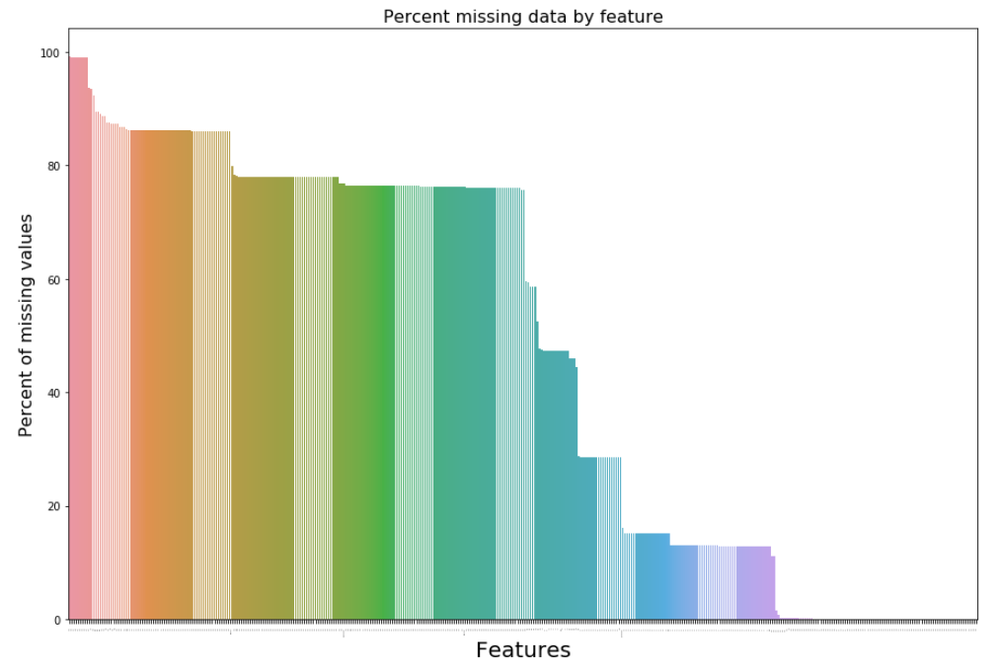
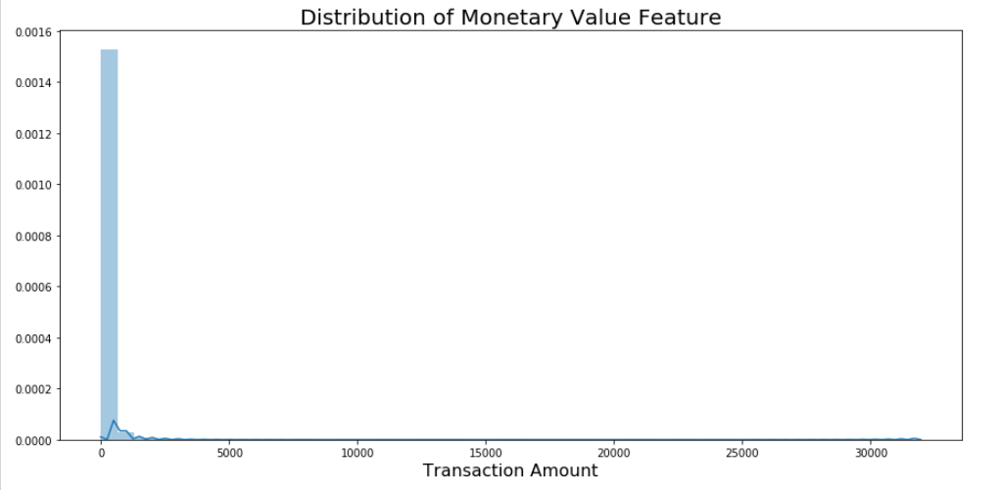
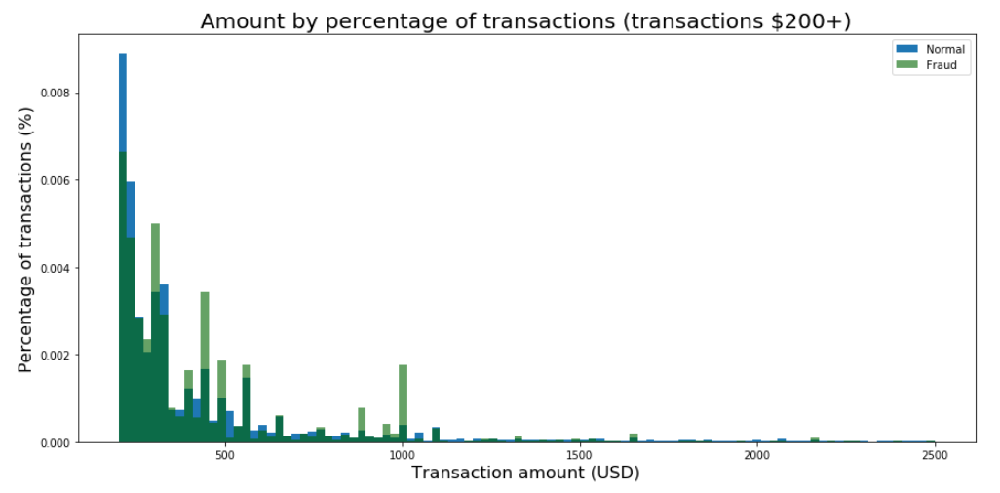

# Kaggle-Competition-IEEE-CIS-Fraud-Detection

## Project Overview

* Goal: Utilize Machine Learning Model to identify fraud based on the given dataset. 
* Tools: Python, R
* Dataset: https://www.kaggle.com/c/ieee-fraud-detection/data 

## Exploratory Data Analysis
{:height="50%" width="50%"}

